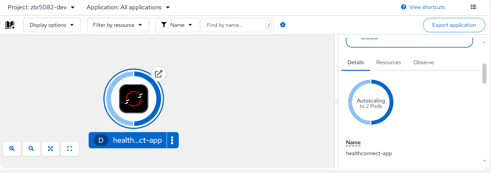
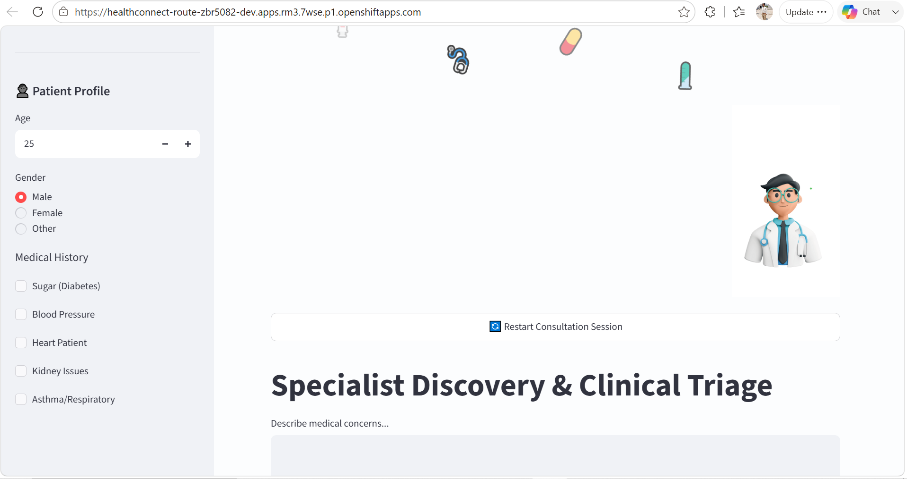

# 🏥 HealthConnectPro: Enterprise AI Medical Triage on OpenShift


HealthConnectPro is a cloud-native, AI-powered medical triage system. This repository contains the **Infrastructure as Code (IaC)** and **CI/CD Pipeline** configurations used to migrate a stateful Python application from a basic hosting environment (Render) to a production-ready **Red Hat OpenShift** cluster.

---

## 🚀 Project Visuals
| Deployment Topology | Final Elite UI |
| :---: | :---: |
|  |  |
*Screenshots showing the HPA scaling to 2 pods and the final Streamlit dashboard running on OpenShift.*

---

## 🏗️ Infrastructure as Code (IaC) Components
The entire environment is defined in modular YAML files, allowing for 1-click reconstruction of the full stack:

1.  **`01-secret.yaml`**: Secure management of API Keys (Groq, Serper) and SMTP credentials.
2.  **`02-pvc.yaml`**: Persistent Volume Claim (1Gi) for SQLite database state preservation.
3.  **`03-deployment.yaml`**: Application manager with resource limits and environment overrides.
4.  **`04-hpa.yaml`**: Horizontal Pod Autoscaler (Min: 1, Max: 3) based on CPU utilization.
5.  **`05-imagestream.yaml`**: OpenShift-native image tracking for automated rollouts.
6.  **`06-pipeline.yaml`**: Tekton Pipeline defining the build-and-deploy workflow.
7.  **`08-pipelinerun.yaml`**: Execution trigger for the CI/CD process.
8.  **`09-route.yaml`**: Public-facing HTTPS endpoint with Edge SSL termination and auto-redirect.

---

## 🛠️ The DevOps Battle Log: Errors & Solutions
Migrating to an enterprise environment like OpenShift presented several challenges. Here is how we solved them:

### 1. The Persistence Problem (Stateful vs Stateless)
*   **Error**: Containers are ephemeral; the SQLite database was deleted on every restart.
*   **Solution**: Implemented a **Persistent Volume Claim (PVC)** and updated `database.py` to use a dynamic `DATA_DIR` environment variable.

### 2. Streamlit Permission Crash
*   **Error**: `OSError: [Errno 13] Permission denied: '/.streamlit'`.
*   **Solution**: OpenShift runs containers with random UIDs. We forced Streamlit to use `/tmp` for config and credentials using `STREAMLIT_CONFIG_DIR` and `HOME` environment variables.

### 3. Tekton ClusterTask vs. Local Task
*   **Error**: `ClusterTask "git-clone" not found`.
*   **Solution**: Modern OpenShift environments lock down global ClusterTasks. We imported official Tekton Task definitions directly into our local namespace to regain control.

### 4. SCC Security Violations
*   **Error**: `privileged containers are not allowed`.
*   **Solution**: The standard S2I buildah task required root privileges. We switched to a **Rootless S2I Binary Build** strategy using the OpenShift internal build engine.

### 5. Python Dependency Hell (The MCP Conflict)
*   **Error**: `Could not find a version that satisfies the requirement mcp`.
*   **Solution**: The `mcp` library requires Python 3.10+. We upgraded the OpenShift Builder image from Python 3.9 to **Python 3.11** to support modern AI libraries.

### 6. The EOFError (Interactive Input)
*   **Error**: `EOFError: EOF when reading a line`.
*   **Solution**: Standard Python `input()` fails in a containerized web environment. We refactored the logic to use **Streamlit Web Widgets** (`st.text_input`), transforming a terminal script into a true web application.

---

## 🛠️ Deployment Instructions
To replicate this infrastructure in a new OpenShift project:

```bash
# 1. Apply the core infrastructure
oc apply -f 01-secret.yaml,02-pvc.yaml,03-deployment.yaml,04-hpa.yaml,05-imagestream.yaml

# 2. Install the Tekton Tasks
oc apply -f https://raw.githubusercontent.com/tektoncd/catalog/main/task/git-clone/0.9/git-clone.yaml

# 3. Create the Build Config
oc new-build --name=healthconnect-build --strategy=source --binary --image-stream=python:3.11-ubi9

# 4. Run the Pipeline
oc create -f 08-pipelinerun.yaml

# 5. Expose the App
oc apply -f 09-route.yaml
